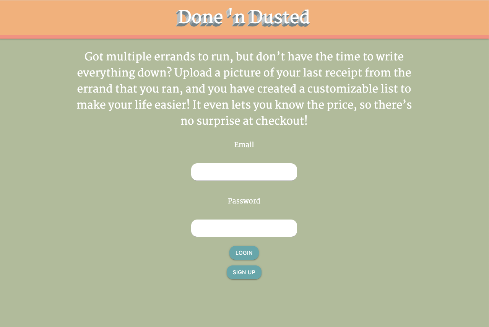
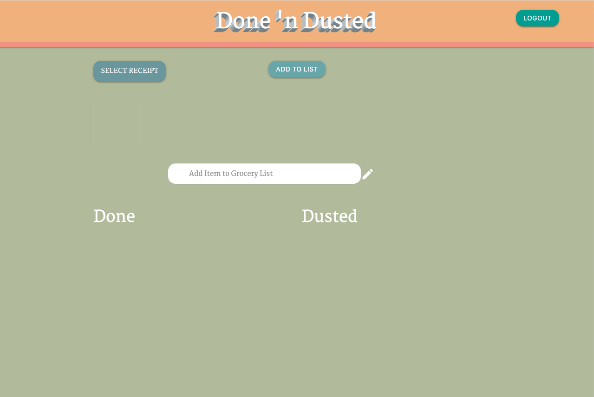

# Grocr
## Description 

This is our second project for the GT Full Stack Flex Program. This project was created to provide a solution for your personalized errand list! We created a website where the user can upload a receipt of their previous receipts. It will then be put into an itemized list that is modifiable. You can add items by writing them in, move them to past purchases, and delete items.

## Table of Contents

* [Installation](#installation)
* [Usage](#usage)
* [Credits](#credits)
* [MIT License](#mit_license)
* [Badges](#badges)
* [Contributing](#contributing)
* [Tests](#tests)

## Installation

1. Clone the repo
2. Open the index.html file

[Heroku Link to Code](https://fathomless-sands-26873.herokuapp.com/)

[Link to Code](https://github.com/yoohooitstoo/grocr-receipt-app)
 
[Crystal's Portfolio Page](https://github.com/CrystalWatkins)

[John's Portfolio Page](https://github.com/roblingjohn)

[Stuart's Portfolio Page](https://github.com/yoohooitstoo)

[Sharon's Portfolio Page](https://github.com/sharonkim09)

## Usage 

This project combined a lot of the things that we have learned in class. 
It includes ....

[Heroku Link to Code](https://fathomless-sands-26873.herokuapp.com/)

[Link to Code](https://github.com/yoohooitstoo/grocr-receipt-app).
 
 
 
 

## Credits

This was our second project for the Georgia Tech, FullStack Flex Program.
Veryfi API [https://api.veryfi.com/api/v7/partner/documents/]

## MIT_License

Copyright (c) [2020] [Crystal Watkins, John Robling, Stuart Scott, and Sharon Kim]

Permission is hereby granted, free of charge, to any person obtaining a copy
of this software and associated documentation files (the "Software"), to deal
in the Software without restriction, including without limitation the rights
to use, copy, modify, merge, publish, distribute, sublicense, and/or sell
copies of the Software, and to permit persons to whom the Software is
furnished to do so, subject to the following conditions:

The above copyright notice and this permission notice shall be included in all
copies or substantial portions of the Software.

THE SOFTWARE IS PROVIDED "AS IS", WITHOUT WARRANTY OF ANY KIND, EXPRESS OR
IMPLIED, INCLUDING BUT NOT LIMITED TO THE WARRANTIES OF MERCHANTABILITY,
FITNESS FOR A PARTICULAR PURPOSE AND NONINFRINGEMENT. IN NO EVENT SHALL THE
AUTHORS OR COPYRIGHT HOLDERS BE LIABLE FOR ANY CLAIM, DAMAGES OR OTHER
LIABILITY, WHETHER IN AN ACTION OF CONTRACT, TORT OR OTHERWISE, ARISING FROM,
OUT OF OR IN CONNECTION WITH THE SOFTWARE OR THE USE OR OTHER DEALINGS IN THE
SOFTWARE.

## Badges

## Contributing

Contributors: Crystal Watkins, John Robling, Sharon Kim, Stuart Scott, and Peter Colella.
Not currently taking any additional contributions at this time.

## Tests

There is no test needed for this project. 